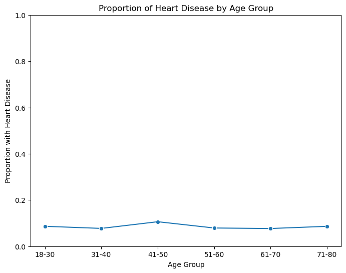
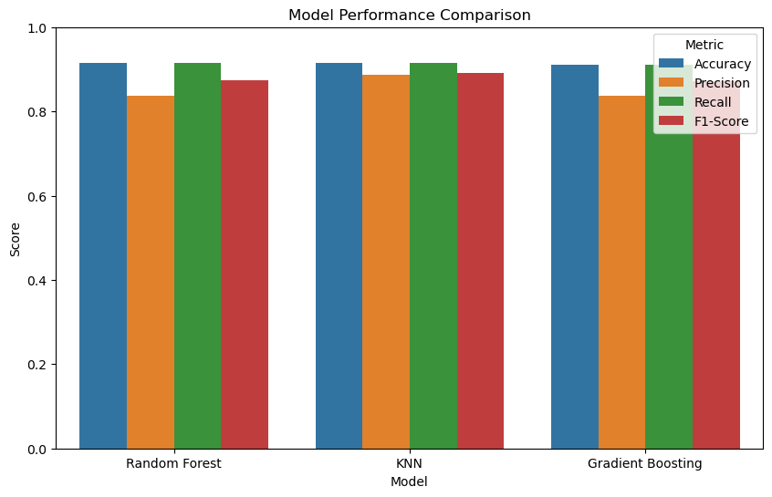

# ❤️ Heart Disease Prediction - AI/ML Mini Project

This project aims to **predict the likelihood of heart disease** in individuals based on various health metrics using **machine learning models**. The goal is to leverage data-driven insights for early detection and intervention.

## 🧠 Project Overview

- **Branch**: Computer Engineering  
- **Semester**: VI  
- **Course**: Artificial Intelligence & Machine Learning (202046702)  
- **Institution**: G H Patel College of Engineering & Technology  
- **Academic Year**: 2024–25 (ODD Term)  
- **Submitted By**:  
  - Meet Dadhaniya (12202040501038)  
  - Param Dholakia (12202040501049)  
- **Guide**: Dr. Priyang Bhatt

---

## 📊 Dataset Description

| Feature                         | Description                                     |
|----------------------------------|-------------------------------------------------|
| `ID`                            | Unique identifier                               |
| `Age`                           | Age in years                                    |
| `Gender`                        | Male/Female                                     |
| `Height_c`                      | Height in centimeters                           |
| `Weight_kg`                     | Weight in kilograms                             |
| `BMI`                           | Body Mass Index                                 |
| `Daily_Steps`                   | Steps per day                                   |
| `Calories_Intake`              | Daily calorie intake (calories)                 |
| `Hours_of_Sleep`                | Sleep per day (in hours)                        |
| `Heart_Rate`                    | Resting heart rate (bpm)                        |
| `Blood_Pressure`                | Blood pressure (mmHg)                           |
| `Exercise_Hours_per_Week`       | Hours of exercise per week                      |
| `Smoker`                        | Yes/No                                          |
| `Alcohol_Consumption_per_Week`  | Alcohol units consumed per week                 |
| `Diabetic`                      | Yes/No                                          |
| `Heart_Disease`                 | Target: Heart disease present (Yes/No)          |

---

## 🔧 Data Preprocessing

- **Encoding**:  
  - `Gender`: Male → 0, Female → 1  
  - `Smoker`, `Diabetic`, `Heart_Disease`: No → 0, Yes → 1

- **Blood Pressure Split**:  
  - `Blood_Pressure` was split into `Max_BP` (systolic) and `Min_BP` (diastolic)

---

## 📈 Exploratory Data Analysis

The plot below shows how the proportion of individuals with heart disease varies across age groups:



---

## 🧪 Model Training and Evaluation

### Models Used:
- **Random Forest**
- **K-Nearest Neighbors (KNN)**
- **Gradient Boosting**

Each model was evaluated using **Accuracy**, **Precision**, **Recall**, and **F1-Score**.

### 📋 Performance Table:

| Model              | Accuracy | Precision | Recall | F1-Score |
|-------------------|----------|-----------|--------|----------|
| Random Forest      | 0.915    | 0.837     | 0.915  | 0.874    |
| KNN                | 0.915    | 0.887     | 0.915  | 0.890    |
| Gradient Boosting  | 0.910    | 0.837     | 0.910  | 0.872    |

### 📊 Model Comparison Plot



---

## ✅ Conclusion

- All three models—Random Forest, KNN, and Gradient Boosting—demonstrated strong predictive ability.
- **KNN** achieved the best **F1-Score**, making it slightly more balanced.
- **Age** was identified as a **key risk factor**.
- Future improvements can include more diverse features and larger datasets.

---

## 📁 File Structure

```
├── health_prediction.ipynb
├── model_plot.png
├── eda_plot.png
├── README.md
```

---

## 📚 License

This is a student mini-project developed for academic purposes under the course **Artificial Intelligence & Machine Learning**.

---

> _Prepared by Meet Dadhaniya & Param Dholakia_
